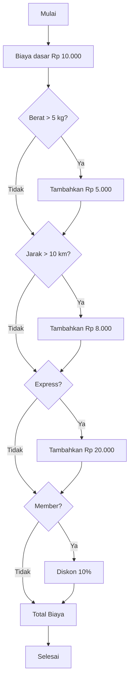

# Program Paket Sederhana

## Soal

Sebuah jasa pengiriman memiliki aturan biaya yang bergantung pada beberapa faktor. Biaya dasar pengiriman ditetapkan sebesar Rp 10.000.
Jika berat paket melebihi 5 kg, maka akan dikenakan tambahan biaya sebesar Rp 5.000. Selain itu, jika jarak pengiriman lebih dari 10 km, maka ada tambahan biaya sebesar Rp 8.000. 
Jika pelanggan memilih layanan pengiriman express, maka akan dikenakan tambahan biaya sebesar Rp 20.000. Namun, jika pelanggan merupakan member, mereka akan mendapatkan diskon 10% dari total biaya pengiriman yang dihitung sebelum diskon. 

Buatlah sebuah fungsi dalam Python yang dapat menghitung total biaya pengiriman berdasarkan aturan tersebut, dengan parameter berat paket, jarak pengiriman, jenis pengiriman (biasa atau express), serta status keanggotaan pelanggan (member atau non-member).

## Flowchart


# Demo program

```python
def hitung_biaya_pengiriman(berat, jarak, express=False, member=False):
    # Biaya dasar
    biaya = 10000
    
    # Tambahan biaya jika berat lebih dari 5 kg
    if berat > 5:
        biaya += 5000
    
    # Tambahan biaya jika jarak lebih dari 10 km
    if jarak > 10:
        biaya += 8000
    
    # Tambahan biaya untuk layanan express
    if express:
        biaya += 20000
    
    # Diskon untuk member
    if member:
        biaya *= 0.9  # Diskon 10%
    
    return int(biaya)  # Konversi ke integer untuk hasil biaya dalam rupiah

# Contoh penggunaan
print(hitung_biaya_pengiriman(6, 15, express=True, member=True))  # Contoh kasus
```
## Output Program
```
PS C:\Users\Haikal LNH> & "C:/Users/Haikal LNH/AppData/Local/Programs/Python/Python313/python.exe" "e:/program paket sederhana.py"
38700
```
## Penjelasan Penggunaan
Misalkan kita menghitung biaya untuk paket dengan spesifikasi berikut:

 -Berat: 6 kg (melebihi 5 kg, jadi ada tambahan Rp 5.000)

 -Jarak: 15 km (lebih dari 10 km, jadi ada tambahan Rp 8.000)

 -Layanan Express (tambahan Rp 20.000)

 -Member (dapat diskon 10%)

Perhitungan:

1. Biaya dasar: Rp 10.000

2. Tambahan berat: Rp 5.000 → Rp 15.000
3. Tambahan jarak: Rp 8.000 → Rp 23.000
4. Tambahan express: Rp 20.000 → Rp 43.000
5. Diskon 10% untuk member: 10% dari Rp 43.000 = Rp 4.300
6. Total biaya setelah diskon: Rp 43.000 - Rp 4.300 = Rp 38.700
